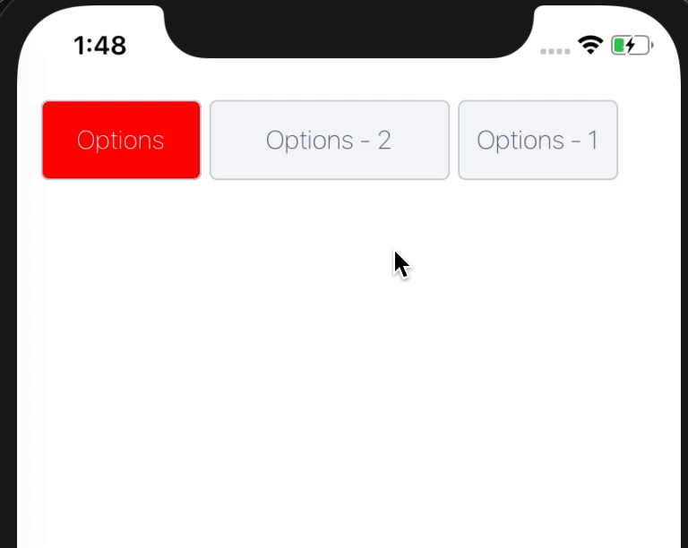

# rnative-dropdown

<p align="center">
  
</p>

## Install

    yarn add rnative-dropdown

## Simple Using

```JS
import React, { Component } from 'react';
import Dropdown, { DropdownItem } from 'rnative-dropdown';

class Example extends Component {
  render() {
    return (
      <Dropdown label="Options">
        <DropdownItem label="item1" onPress={() => alert("item1")} />
        <DropdownItem label="item2" onPress={() => alert("item2")} />
        <DropdownItem label="item3" onPress={() => alert("item3")} />
      </Dropdown>
    )
  }
}
```

## `isDone` Using

If you use done you can wait after the press is on.

```JS
class Example extends Component {
  render() {
    return (
      <Dropdown label="Options">
        <DropdownItem label="item1" onPress={() => alert("item1")} />
        <DropdownItem label="item2" onPress={() => alert("item2")} />
        <DropdownItem isDone={true} label="item3" onPress={(done) => {
          setTimeout(() => {
            
            done();
            
          }, 5000)
        }} />
      </Dropdown>
    )
  }
}
```
